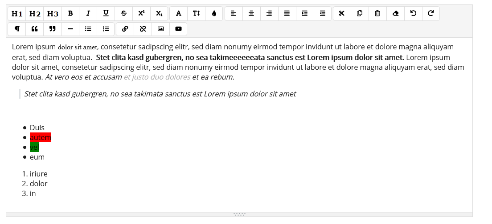

# ngx-text-editor



## Index ##

* [About](#about)
* [Setup](#setup)
* [Documentation](#documentation)
* [Issues](#issues)
* [Contributing](#contributing)
* [Deploy](#deploy)
* [Future Plans](#future-plans)
* [FAQ](#faq)


## About ## 

This is an Angular 8+ WYSIWYG component.  
It has Fortawesome integrated for a more lightweight package

* Visit the [demo (of forked repo)](https://ngx-text-editor.jrquick.com) to see it in action!

## Setup

### Installation

For Angular 8+:

`npm install @joniras/ngx-editor2 --save`

### Documentation

Import `ngx-editor2` module

```typescript
import {NgxTextEditorModule} from "@joniras/ngx-editor2";

@NgModule({
  imports: [ NgxTextEditorModule ]
})
```

Then in HTML

```html
<ngx-text-editor [placeholder]="'Enter text here...'" [spellcheck]="true" [(ngModel)]="htmlContent"></ngx-text-editor>
```

For `ngModel` to work, You must import `FormsModule` from `@angular/forms`

Alternatively you can pass a configuration object

```html
<ngx-text-editor [config]="default" [(ngModel)]="htmlContent"></ngx-text-editor>
```
And in Component (those are the default values)
```typescript
const default = {
  editable: true,
  spellcheck: true,
  height: 'auto',
  minHeight: '0',
  width: 'auto',
  minWidth: '0',
  translate: 'yes',
  enableToolbar: true,
  showToolbar: true,
  placeholder: 'Enter text here...',
  imageEndPoint: '',
  toolbar: [
    ['h1', 'h2', 'h3', 'bold', 'italic', 'underline', 'strikeThrough', 'superscript', 'subscript'],
    ['fontName', 'fontSize', 'color'],
    ['justifyLeft', 'justifyCenter', 'justifyRight', 'justifyFull', 'indent', 'outdent'],
    ['cut', 'copy', 'delete', 'removeFormat', 'undo', 'redo'],
    ['paragraph', 'blockquote', 'removeBlockquote', 'horizontalLine', 'orderedList', 'unorderedList'],
    ['link', 'unlink', 'image', 'video']
  ],
  toolbarTitle: {
    'bold': 'Bold',
    'italic': 'Italic',
    'underline': 'Underline',
    'strikeThrough': 'strikeThrough',
    'superscript': 'Superscript',
    'subscript': 'Subscript',
    'fontName': 'Font Family',
    'fontSize': 'Font Size',
    'color': 'Color Picker',
    'justifyLeft': 'Justify Left',
    'justifyCenter': 'Justify Center',
    'justifyRight': 'Justify Right',
    'justifyFull': 'Justify Full',
    'indent': 'Indent',
    'outdent': 'Outdent',
    'cut': 'Cut',
    'copy': 'Copy',
    'delete': 'Delete',
    'removeFormat': 'Clear Formatting',
    'undo': 'Undo',
    'redo': 'Redo',
    'paragraph': 'Paragraph',
    'blockquote': 'Blockquote',
    'removeBlockquote': 'Remove Blockquote',
    'horizontalLine': 'Horizontal Line',
    'orderedList': 'Ordered List',
    'unorderedList': 'Color Picker',
    'link': 'Insert Link',
    'URLInput': 'URL',
    'urlTextInput': 'Text',
    'urlNewTab': 'Open in new tab',
    'linkSubmit': 'Submit',
    'unlink': 'Unlink',
    'image': 'Insert Image',
    'chooseImage': 'Choose Image',
    'uploadingimage': 'Uploading Image',
    'imageURLInput': 'URL',
    'imageSubmit': 'Submit',
    'video': 'Insert Video',
    'videoURLInput': 'URL',
    'height': 'height (px)',
    'width': 'width (px)',
    'heightwidth': 'Height/Width',
    'videoSubmit': 'Submit',
    'textColor': 'Text',
    'backgroundColor': 'Background',
    'hexInput': 'Hex Color',
    'hexSubmit': 'Submit',
    'fontSubmit': 'Submit',
    'example': 'Ex:'
  }
}
```

## Issues ##

If you find any issues feel free to open a request in [the Issues tab](https://github.com/Joniras/ngx-editor2/issues). If I have the time I will try to solve any issues but cannot make any guarantees. Feel free to contribute yourself.


[npm]: https://www.npmjs.com/
[yarn]: https://yarnpkg.com/lang/en/
[github]: https://jrquick17.github.io/
[wiki]:https://github.com/jrquick17/ngx-text-editor/wiki/ngxTextEditor
[compodoc]: https://compodoc.github.io/website/

## Contributing

A special thanks to all of our contributors! To contribute yourself just submit a [pull request](https://github.com/jrquick17/ngx-text-editor/pulls)!

* [jrquick17](https://github.com/jrquick17)
* [khernik93](https://github.com/khernik93)
* [mzsolt1](https://github.com/mzsolt1)
* [magicben](https://github.com/magicben)
* [Norddeutschland](https://github.com/Norddeutschland)
* [sibiraj-s](https://github.com/sibiraj-s)
* [ssuperczynski](https://github.com/)

## Deploy ##

* ### Generate Docs ###

   * Run `npm run docs:build`
   
* #### Update Version ###

   * Update version `package.json` file in the root directory following [Semantic Versioning (2.0.0)](https://semver.org/).

* ### Build ###

    * Run `npm run build` from root.

* #### Test ###

    * Copy `dist/` contents into `demo/node_modules/ngx-text-editor/`
        * Run from root:  `cp -fr dist/* demo/node_modules/ngx-text-editor/`
    * Run `ionic serve` from `demo/`
    * Run `ionic build --prod` from `demo/`

* #### NPM Release ####

    * Run `npm publish` from `dist/` directory.

* #### Update Changelog ####

    * Add updates to `CHANGELOG.md` in root.

## Future Plans

* Add model for editorConfig 
* Update stackblitz
* Update color picker
